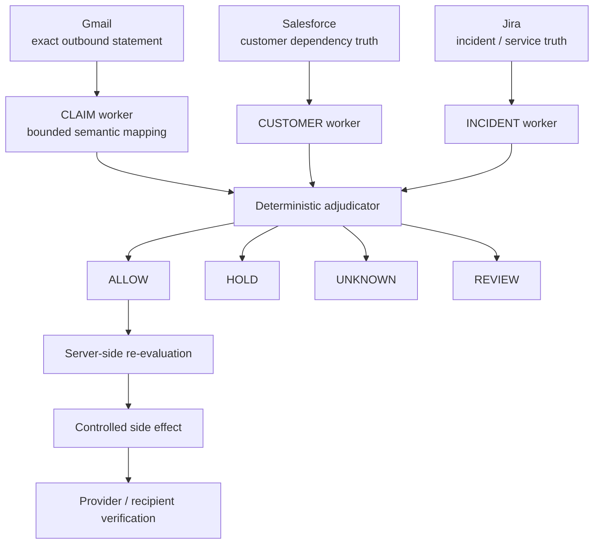

<h1 align="center">PERTAIN</h1>

<p align="center"><strong>One statement. Three customer truths.</strong></p>
<p align="center">Know who an incident update actually applies to before it goes out.</p>

<p align="center">
  <a href="docs/JUDGE-PACKET.md"><strong>Judge Packet</strong></a>
  ·
  <a href="docs/RELIABILITY-BRIEF.md"><strong>Reliability Brief</strong></a>
  ·
  <a href="docs/EVIDENCE-MATRIX.md"><strong>Evidence Matrix</strong></a>
</p>

<p align="center"><sub>Multi-App AI Agent Hackathon · Day-of-event build · Cloudflare release candidate</sub></p>

> **Current status**  
> PERTAIN has verified a real Gmail + Salesforce + Jira runtime, a real model-backed semantic path, a fail-closed stale-evidence path, and one bounded external delivery to the only `ALLOW` recipient in a controlled fixture. Public deployments default to a safe seeded/read-only presentation; external Gmail writes are disabled unless the server is explicitly released for them.

## Why PERTAIN exists

### The pain

During an incident, teams often prepare one recovery update for many customers:

> `Your production workflows are fully restored.`

The sentence looks global. Customer reality is not.

### The problem

Two customers can experience the same incident differently because they depend on different services, regions, obligations and evidence. A third customer may not have enough dependency data to safely establish the claim at all.

Traditional incident tools can coordinate communication. PERTAIN answers a narrower question before a sentence leaves the company:

> **For which intended recipients is this exact statement supported by current evidence?**

### Why PERTAIN is different

PERTAIN does **not** rewrite the message per customer.

It keeps the sentence fixed, then partitions the intended audience by evidence:

- **ACME → HOLD** — a required dependency is degraded.
- **GLOBEX → ALLOW** — the relevant dependencies are fresh and healthy.
- **INITECH → UNKNOWN** — the required dependency map is missing.

**Same message → different customer truths → only evidence-supported recipients can move.**

---

## The truth partition

| Customer | Current verdict | Decisive reason |
|---|---|---|
| ACME | `HOLD` | `EU Auth = DEGRADED` contradicts a full-restoration statement |
| GLOBEX | `ALLOW` | required US dependencies are fresh and healthy |
| INITECH | `UNKNOWN` | required customer dependency evidence is missing |

The evaluator-facing UI renders this as one shared signal rail splitting into three customer truth lanes. The partition — not a chatbot, status page or generic agent console — is the product signature.

---

## Execution

PERTAIN separates language interpretation, external evidence and action authority.



- **Gmail** supplies the exact message and intended recipients.
- **Salesforce** supplies customer-specific dependency / obligation truth.
- **Jira** supplies current service health and freshness.
- **Groq / OpenAI-compatible model path** maps free-form language into a small bounded predicate vocabulary.
- **Deterministic policy** owns the final verdict, freshness/missingness logic and recipient set.
- **Server-side re-evaluation** prevents browser state from forging an allow-list.

The workers may run concurrently for latency and failure isolation. PERTAIN does not claim concurrency is necessary for correctness.

---

## AI boundary

The model is deliberately narrow.

It may map language into one of these bounded semantic forms:

- `ALL_RELEVANT_SERVICES_HEALTHY`
- `NO_RELEVANT_CUSTOMER_IMPACT`
- `SCOPED_SERVICES_HEALTHY`

It does **not** decide whether a customer is safe to message.

The live model-backed external hero run proved:

- `evidence = EXTERNAL`
- `semanticMapping = MODEL`
- ACME = `HOLD`
- GLOBEX = `ALLOW`
- INITECH = `UNKNOWN`

A live model probe also exposed a useful failure mode: a model can try to narrow generic wording such as “production workflows” into an invented service scope. The product now canonicalizes only explicit global recovery phrases before deterministic policy, preserving the model as evidence rather than authority.

---

## Evidence

What is proven today:

- real Gmail + Salesforce + Jira participation in one runtime;
- real model-backed semantic mapping in the external hero path;
- exact `HOLD / ALLOW / UNKNOWN` customer partition;
- stale Jira evidence fails closed to `UNKNOWN` with an empty allowed set;
- `/api/send` performs a fresh server-side evaluation before any external write;
- one controlled external send reached only the `ALLOW` identity;
- matching `HOLD` / `UNKNOWN` identities received no corresponding controlled delivery;
- the first invalid recipient target bounced after provider acceptance, proving that provider acceptance alone is not delivery proof;
- 20/20 bounded controls passed on the locked Verification baseline;
- Next.js and Cloudflare/OpenNext production builds passed on that baseline.

| Area | Status |
|---|---|
| Three-app external runtime | Verified |
| Model-backed semantic path | Verified |
| Fresh hero partition | Verified |
| Stale-evidence fail-closed path | Verified |
| Guarded `ALLOW`-only side effect | Verified |
| Controlled recipient delivery / non-delivery | Verified |
| Production customer deployment | Not claimed |
| Production security review | Not claimed |
| Measured churn / revenue impact | Not claimed |

The strongest product invariant is also the simplest:

> **Missing, stale or contradictory required evidence never becomes `ALLOW`.**

See [`docs/EVIDENCE-MATRIX.md`](docs/EVIDENCE-MATRIX.md) for the claim-by-claim proof boundary.

---

## Reliability

The bounded control suite covers positive, negative and insufficient-evidence behavior, including:

- contradiction → `HOLD`;
- missing dependency evidence → `UNKNOWN`;
- stale relevant evidence → `UNKNOWN`;
- ambiguous wording → `REVIEW`;
- healthy complete evidence → `ALLOW`;
- changed incident state flips the verdict;
- duplicate recipients are deduped;
- only `ALLOW` enters the send plan.

A real stale-data run is intentionally preserved: all three recipients became `UNKNOWN`, the allowed set became empty, and nothing was sent.

A separate real failure is also preserved: the first test recipient did not exist. Gmail accepted the send at the provider edge and later returned `550 5.1.1 No Such User`. PERTAIN records provider acceptance and recipient delivery as separate proof classes.

**Real failure > fake success.**

---

## Demo

Recommended judge path:

1. Read the exact Gmail recovery sentence.
2. Watch the same message split into three customer truth lanes.
3. Read the decisive fact for `HOLD`, `ALLOW` and `UNKNOWN` without navigating away.
4. Inspect one evidence trail showing observed facts → mapped semantics → deterministic rule.
5. Show the locked proof receipt: model path proven, 20/20 controls, stale evidence produced zero sends, controlled GLOBEX delivery verified.
6. Close on: **One statement. Three customer truths.**

The final submission should add the accessible **≤2 minute demo video link here** immediately after recording.

---

## Engineering challenges

### Keeping AI useful without making it the authority

PERTAIN uses the model where language is genuinely fuzzy, then constrains it to a finite predicate contract. Verdicts and side effects remain deterministic.

### Refusing stale green evidence

A healthy service state becomes unsafe evidence when it is too old. PERTAIN applies a freshness window before customer-facing authorization and fails closed to `UNKNOWN`.

### Preventing browser-side recipient forgery

The browser never submits the authoritative recipient set. `/api/send` evaluates again on the server immediately before execution.

### Distinguishing provider acceptance from delivery

The first invalid-recipient test demonstrated that an API success is not end-to-end delivery proof. PERTAIN preserves both the accepted provider result and the later bounce.

### Making a public demo safe

External Gmail writes are disabled by default via `PERTAIN_EXTERNAL_SEND_ENABLED=0`. Seeded demo mode remains repeatable and clearly labeled. Enabling a real consequential side effect requires an explicit server-side operator choice.

---

## Security & privacy

- `.env`, `.env.local`, provider tokens and local secrets are gitignored.
- No credentials are required for seeded demo mode.
- External side effects fail closed unless the server explicitly enables them.
- Public documentation uses customer labels and proof classes rather than private mailbox addresses.
- Provider authentication in the hackathon build is not presented as production-hardened.
- PERTAIN does not expose hidden chain-of-thought; the UI shows only bounded evidence classes and policy results.

---

## Repository guide

The public tree is intentionally small:

- `app/` — evaluator-facing Truth Switchboard and API routes
- `lib/` — domain contracts, semantic mapper, provider adapters, deterministic policy and orchestrator
- `tests/` — bounded reliability controls
- `docs/` — evidence matrix, judge packet, negative event and reliability brief
- `.github/workflows/` — build / test verification
- `open-next.config.ts` + `wrangler.jsonc` — Cloudflare/OpenNext release path

Internal orchestration, private credentials, personal mailbox details and project-management handovers do not belong in this repository.

---

## Development

```bash
npm install
npm test
npm run build
npm run build:cloudflare
```

Local seeded demo:

```bash
cp .env.example .env.local
npm run dev
```

`.env.example` defaults to safe seeded mode and external sends disabled.

For a private external proof environment, configure the provider credentials locally and intentionally change only the required server flags. Never commit `.env.local`.

---

## Cloudflare release

Cloudflare Workers via OpenNext is the primary deployment target.

```bash
npm run build:cloudflare
npm run preview:cloudflare
npm run deploy:cloudflare
```

Before the final public deploy, rerun the changed-head tests and both production builds.

---

## Claim boundary

PERTAIN claims only what the evidence establishes.

It does **not** claim:

- production customer adoption;
- production security or universal reliability;
- universal CRM / incident-platform coverage;
- measured churn or revenue reduction;
- legal or compliance correctness;
- independent real-customer mailbox deliverability;
- that concurrency itself is required for correct verdicts.

## License

MIT — see [`LICENSE`](LICENSE).
