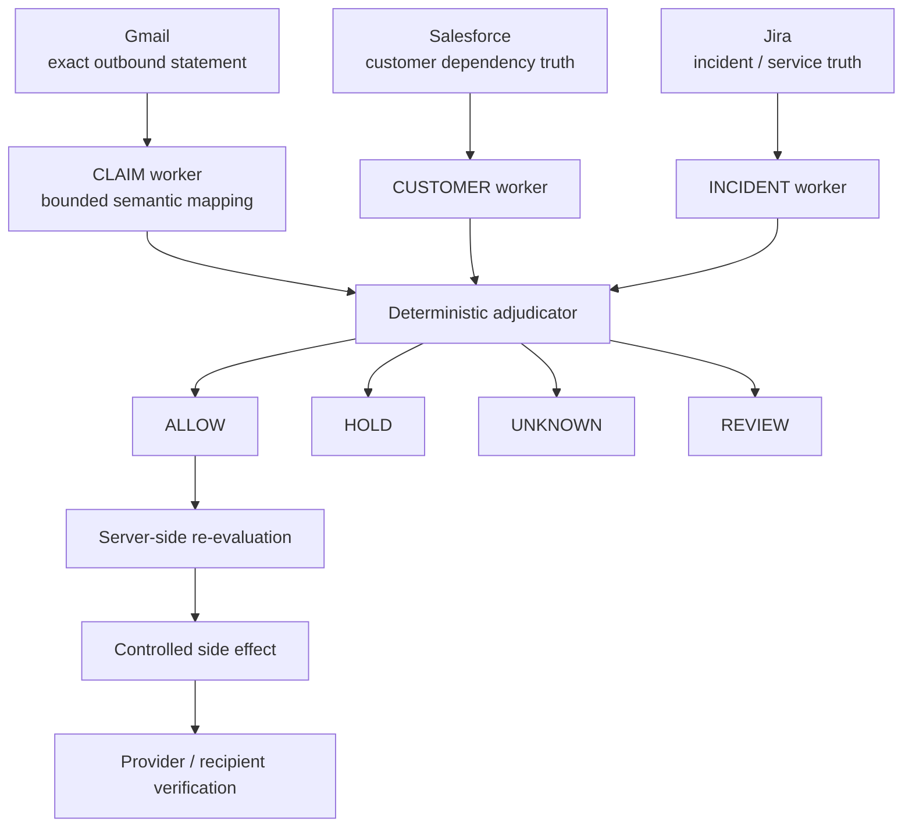

<h1 align="center">PERTAIN</h1>

<p align="center"><strong>One statement. Three customer truths.</strong></p>
<p align="center">Know who an incident update actually applies to before it goes out.</p>

<p align="center">
  <a href="https://pertain.faadil-casecraft.workers.dev/"><strong>🌐 Live App</strong></a>
  ·
  <a href="https://github.com/Faadil1/PERTAIN/raw/2fdeaf8a04e5d5797385857d0d147330ea021e80/demo-video%2Fout%2Fpertain-demo.mp4"><strong>🎬 Demo Video</strong></a>
  ·
  <a href="docs/JUDGE-PACKET.md"><strong>Judge Packet</strong></a>
  ·
  <a href="docs/RELIABILITY-BRIEF.md"><strong>Reliability Brief</strong></a>
  ·
  <a href="docs/EVIDENCE-MATRIX.md"><strong>Evidence Matrix</strong></a>
</p>

<p align="center"><sub>Multi-App AI Agent Hackathon · Day-of-event build · Cloudflare Workers</sub></p>

## Submission links

- **Live product:** https://pertain.faadil-casecraft.workers.dev/
- **≤2 minute Remotion demo:** https://github.com/Faadil1/PERTAIN/raw/2fdeaf8a04e5d5797385857d0d147330ea021e80/demo-video%2Fout%2Fpertain-demo.mp4
- **Repository:** https://github.com/Faadil1/PERTAIN

> **Current status**  
> PERTAIN has verified a real Gmail + Salesforce + Jira runtime, a real model-backed semantic path, a fail-closed stale-evidence path, and one bounded external delivery to the only `ALLOW` recipient in a controlled fixture. The public Cloudflare deployment defaults to a safe seeded/read-only presentation; external Gmail writes are disabled unless the server is explicitly released for them.

## Why PERTAIN exists

During an incident, teams often prepare one recovery update for many customers:

> `Your production workflows are fully restored.`

The sentence looks global. Customer reality is not.

Two customers can depend on different services, regions and obligations. A third may not have enough dependency evidence to establish the claim safely at all.

PERTAIN asks one narrow question before the sentence leaves the company:

> **For which intended recipients is this exact statement supported by current evidence?**

PERTAIN does **not** rewrite the message per customer. It keeps the sentence fixed, then partitions the intended audience by evidence:

- **ACME → HOLD** — a required dependency is degraded.
- **GLOBEX → ALLOW** — the relevant dependencies are fresh and healthy.
- **INITECH → UNKNOWN** — the required dependency map is missing.

**Same message → different customer truths → only evidence-supported recipients can move.**

## The truth partition

| Customer | Verdict | Decisive reason |
|---|---|---|
| ACME | `HOLD` | `EU Auth = DEGRADED` contradicts the full-restoration statement |
| GLOBEX | `ALLOW` | required US dependencies are fresh and healthy |
| INITECH | `UNKNOWN` | required customer dependency evidence is missing |

The evaluator-facing UI renders this as one shared signal rail splitting into three customer-truth lanes. The partition — not a chatbot, status page or generic agent console — is the product signature.

## How it works



- **Gmail** supplies the exact message and intended recipients.
- **Salesforce** supplies customer-specific dependency and obligation truth.
- **Jira** supplies current service-health and freshness evidence.
- **Groq / OpenAI-compatible model path** maps free-form language into a bounded semantic vocabulary.
- **Deterministic policy** owns the final verdict, missingness/freshness logic and authorized recipient set.
- **Server-side re-evaluation** prevents browser state from forging an allow-list.

The three evidence workers run concurrently for latency and failure isolation. PERTAIN does not claim concurrency is required for correctness.

## AI boundary

The model may map language into bounded semantic forms such as:

- `ALL_RELEVANT_SERVICES_HEALTHY`
- `NO_RELEVANT_CUSTOMER_IMPACT`
- `SCOPED_SERVICES_HEALTHY`

It does **not** decide whether a customer is safe to message.

A real model-backed external hero run proved:

- `evidence = EXTERNAL`
- `semanticMapping = MODEL`
- ACME = `HOLD`
- GLOBEX = `ALLOW`
- INITECH = `UNKNOWN`

The model remains evidence, not authority. Final authorization is deterministic and fails closed.

## Evidence

What is proven today:

- real Gmail + Salesforce + Jira participation in one runtime;
- real model-backed semantic mapping in the external hero path;
- exact `HOLD / ALLOW / UNKNOWN` customer partition;
- stale Jira evidence fails closed to `UNKNOWN` with an empty allowed set;
- `/api/send` performs a fresh server-side evaluation before any external write;
- one controlled external send reached only the `ALLOW` identity;
- matching `HOLD` / `UNKNOWN` identities received no corresponding controlled delivery;
- the first invalid recipient target bounced after provider acceptance, proving provider acceptance alone is not delivery proof;
- 20/20 bounded controls passed on the locked Verification baseline;
- Next.js and Cloudflare/OpenNext production builds passed.

| Area | Status |
|---|---|
| Three-app external runtime | Verified |
| Model-backed semantic path | Verified |
| Fresh hero partition | Verified |
| Stale-evidence fail-closed path | Verified |
| Guarded `ALLOW`-only side effect | Verified |
| Controlled recipient delivery / non-delivery | Verified |
| Production customer deployment | Not claimed |
| Production security review | Not claimed |
| Measured churn / revenue impact | Not claimed |

> **Missing, stale or contradictory required evidence never becomes `ALLOW`.**

See [`docs/EVIDENCE-MATRIX.md`](docs/EVIDENCE-MATRIX.md) for the claim-by-claim proof boundary.

## Reliability

The bounded controls cover positive, negative and insufficient-evidence paths, including:

- contradiction → `HOLD`;
- missing dependency evidence → `UNKNOWN`;
- stale relevant evidence → `UNKNOWN`;
- ambiguous wording → `REVIEW`;
- healthy complete evidence → `ALLOW`;
- changed incident state flips the verdict;
- duplicate recipients are deduped;
- only `ALLOW` enters the send plan.

A real stale-data run is intentionally preserved: all three recipients became `UNKNOWN`, the allowed set became empty, and nothing was sent.

A separate real failure is also preserved: the first test recipient did not exist. Gmail accepted the message at the provider edge and later returned `550 5.1.1 No Such User`. PERTAIN records provider acceptance and recipient delivery as separate proof classes.

**Real failure > fake success.**

## Demo story

The rendered demo follows:

**RUBRIC → PAIN → PROBLEM → DIFFERENTIATOR → EXECUTION → EVIDENCE → STORY**

Judge memory sentence:

> **PERTAIN takes one incident update and proves which customers it is actually true for before anyone sends it.**

Short version:

> **Same message. Three customers. HOLD / ALLOW / UNKNOWN.**

## Security & privacy

- `.env`, `.env.local`, provider tokens and local secrets are gitignored.
- No credentials are required for seeded demo mode.
- External side effects fail closed unless explicitly enabled server-side.
- Public documentation uses customer labels and proof classes rather than private mailbox addresses.
- Provider authentication in the hackathon build is not presented as production-hardened.
- PERTAIN does not expose hidden chain-of-thought; the UI shows only bounded evidence classes and policy results.

## Repository guide

- `app/` — evaluator-facing Truth Switchboard and API routes
- `lib/` — domain contracts, semantic mapper, provider adapters, deterministic policy and orchestrator
- `tests/` — bounded reliability controls
- `docs/` — evidence matrix, judge packet, negative event and reliability brief
- `demo-video/` — Remotion source, captured live product frames and final demo
- `.github/workflows/` — build/test verification and demo rendering
- `open-next.config.ts` + `wrangler.jsonc` — Cloudflare/OpenNext release path

## Development

```bash
npm install
npm test
npm run build
npm run build:cloudflare
```

Local seeded demo:

```bash
cp .env.example .env.local
npm run dev
```

## Cloudflare release

```bash
npm run build:cloudflare
npm run preview:cloudflare
npm run deploy:cloudflare
```

## Claim boundary

PERTAIN does **not** claim:

- production customer adoption;
- production security or universal reliability;
- universal CRM / incident-platform coverage;
- measured churn or revenue reduction;
- legal or compliance correctness;
- independent real-customer mailbox deliverability;
- that concurrency itself is required for correct verdicts.

## License

MIT — see [`LICENSE`](LICENSE).
